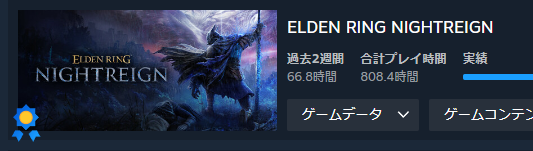

+++
title = "【雑記】脱ナイトレインしたい"
date = "2026-04-20"

categories = [
"Diary","Random"
]

tags = [
"Diary","日記"
]
draft = false
+++

タイトルの通り脱ナイトレインしたい。
最近は仕事のストレスもあって仕事終了即ナイトレインにこもることが多い。
休日何か気づいたら13～26時とかでやってる。まずい。

この2週間で67時間やってるらしい。

1月半ばにカンストをして、落ち着くかと思ったがカンストした時点のプレイ時間が400時間らしい。
そっからもう400時間やってるらしい。怖いね。

今年の目標である 「**早寝早起き**」 とは縁の遠い生活をしている。

別に楽しければいいんでない？と思うこともあるが、あんまよくないと思ってる。
何がというと、ナイトレインをすることで **何も得ない** のである。

ずっと同じことの繰り返し。ローグライク特有の **上手く通った時の脳汁** のために何時間も繰り返す。

勝っても何かいまいち気持ち良くない勝ち方だった。もう一回。
ローグライク要素で思った通りのプレイをさせてもらえなかった。もう一回。
負けるとイラつく。んでもう一回。

出撃毎に展開は変わるが、おおよそやることは変わらない。
別にやるのは構わないと思う。楽しいのは事実やし。

しかし休日をつぶす、平日仕事に支障をきたしてまでやる必要はないのである。

しかもガチャ要素もある。攻撃力上昇や最大HP上昇などの効果があるものを引けるのである。
出撃するとポイントがもらえてそれで引ける。ガチャである。ソシャゲである。
ここでもたまらんのを引くと脳汁。

ドパガキ [^1] ならぬ ドパオジ の爆誕である。

昔からハマると一生やるのは変わるわけないんですわな。
MMO（レッドストーン）もビートマニアも。
ローグライクでいうとヴァンサバ、Balatroに人生を破壊されそうになったことがある。

ここいらでテコ入れしないとね。

ということで風呂入ってDMCのRTAを直起動。
意外と効果があった気がする。

最近ナイトレインに脳を焼かれすぎて配信もやらなくなってたりした。
ストレスが半端なかったのでやったとこでってのもあったかもだが。

そこで配信も起動。
正直配信中も終わったら時間あるしナイトレイン一回やろうかなと思った。

~~Mission9で萎え落ちしつつ~~ 24時頃に配信終了。健康的である。
Mission９の練習をして25時。ちょうどいいので寝よう。

ナイトレインを起動する前に文したためるか。
ということで一旦日記書く。使ってなかったしね。

早く寝れると思ったが日記書くの時間かかるね。1時に書き始めたのにもう半だわい。
正直この取り組みはあまり成功する気はしてない。だってもうやりたいもんね。ナイトレイン。

寝ますか。
12時寝の7時起き生活をしてみたい。

ほな。

[^1]: ドーパミン中毒のガキ、TikTokやYoutubeShort、Twitterのおすすめ欄などの短時間で刺激を得ることに慣れ過ぎた人々
