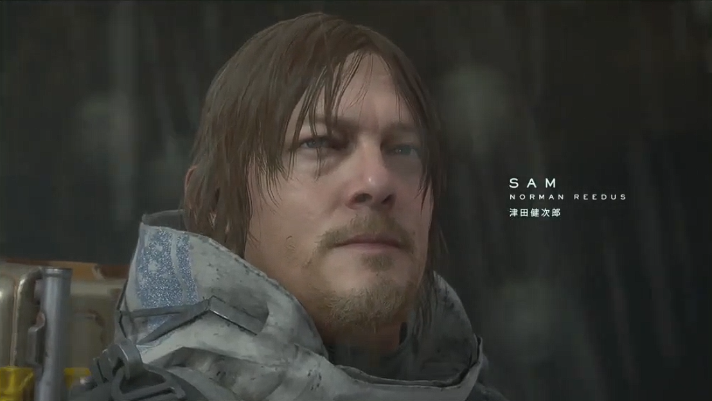
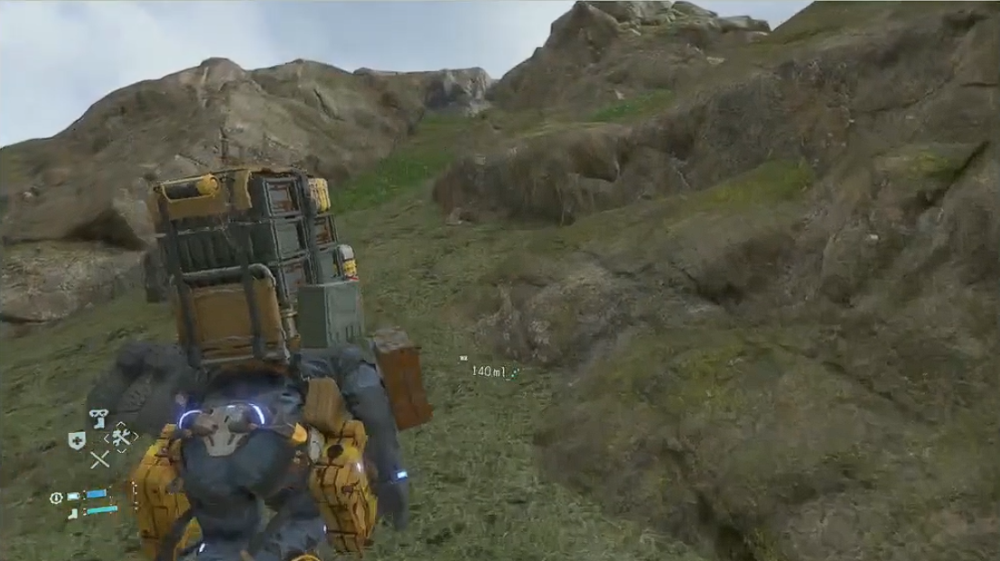
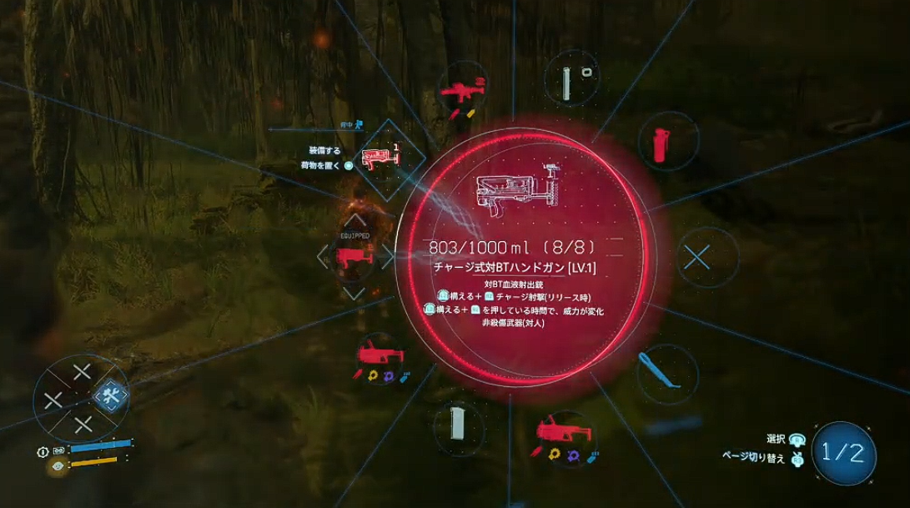

+++
title = "DEATH STRANDING DIRECTOR’S CUT"
date = "2025-11-24"

categories = [
"Gamemo"
]

tags = [
"Gamemo"
]
draft = false
+++

クリア時間：約40時間

**※当たり前ですがネタバレを含みます**

## 概要っぽいもの

言わずと知れたと言ったらアレだが **「あの」** 小島監督の独立後、衝撃のデビュー作。
各所からいいゲームであると聞いており、2025年11月24日時点ではPS Plus Extraでプレイできたのでプレイ。

伝説の配達人、**サム・ポーターブリッジズ** が本作の主人公。（画像の人）

この伝説の配達人がアメリカ復興のために、西へ東へ奔走する話。

配達と言いながらこの世界はめちゃくちゃ進んでいる。
デバイスからホログラムで情報を表示したり、ホログラムで人と通話もできる。
辺りに普通に設置されてる機械から、車を作れたり武器を作れたりする。
人間を離れた地域に、テレポートしたりといったこともできる。

なんならドローンとかもものすごく進化しているので、コイツで配達も全然できるししてた。

しかしあまりにも高度に自動化されすぎて、人間の方が耐えられなくなったらしい。
何か人恋しくなっちゃったんだって、精神壊れるレベルで。
わがままだね。

---

アメリカ復興って、アメリカは崩壊したんか？
→ **はい** (違ったらすまん)

何かめちゃくちゃになりました。
謎の爆発がめっちゃ起きてめちゃくちゃになりました。
浴びるといろいろあって死ぬ変な雨も降るし、BTっていう変な幽霊みたいなのも出るしそいつに人間が捕まったら都市消滅するくらいの事も起きるしでめちゃくちゃ。

めちゃくちゃ進んでる世界なので、とある通信網を繋ぐとあらゆる情報を共有することができる。
諸々の説明は省くが、大事な人を助けに行くのとアメリカ大陸を通信で繋ごうとなった。
なので西へ東へ奔走して繋いでいきましょうやの巻です。

これも多くは語りませんが、マッツミケルセンで **感情** になれるので是非やってください。

## 感想

### ストーリー面

流石 世界の小島、難解。
途中から **「アカン」** と思ってメモを取り始めてから結構整理でき始めたと思う。
メモ取った方がいい、ストーリー難しいので終わるころに「？」ってならないように。

正直取っててもわからん部分が多かった。
考察を読んでなるほど～となったところがちょいちょいあった。

ただ、とある核心については最後の方でわかるので、それなりに入ってくると思う。
もう一個、タイトルにもあるデスストランディングって何？みたいなとこは本当に難解。
いまだに理解しきれていない部分が多い。

ただそれでも入ってくる話だけでもかなり良い。
それぞれ人に物語があり、その物語が繋がっていく。

最終的に**そこに繋がるのか・・・！！！**となる。

終わった後はやはり一本映画を見終えたかのような余韻があり、非常によい。
是非体験してみてほしい。

### アクション面

移動に関してはもう世の中荒廃してる部分があるので、悪路を地力で踏破しないといけない。
そこを工夫しながら行かなければならない。
接敵の関係もあり、結構フラストレーションがたまる場面も多くあるが、戦略がハマったりすると脳汁がでる。

画像は悪路の一例。
既プレイの方はわかると思いますが、これは可愛い方で、もはや**悪路ではない**レベル。

乗り物もある。
バイク、車とゲーム内で乗り物に乗るの大好きマンなので大満足。
車にもう少し疾走感あってもうれしかったけどしょうがない感はある。

---

ゲーム面では結構ちゃんとアクションしていた。
ストーリー重視なんかな～と勝手に思ってたけど、流石はメタルギアを作った男。
アクション面もちゃんと歯ごたえがあった。

武器種がかなりあり、敵によって「こっちの方がいいな・・・」などある。

スニーキングの選択肢も全然あるが、悪路の途中に出たりするので、足元もあんましよくない。
そんな中結構むずかったりするので処理したりスニーキングしたりと頑張る。メタルギアでもやったね。

人間の敵もいるが、こっちの方が正直ダルい。
一番怖いのはやっぱり **人** ってことですかね。

大ボスもちゃんといて、結構歯ごたえがある。
何なら一発クリアしたボスいたかもだがあんま記憶にない。

一応下記は私のプレイ配信アーカイブPart1は下記です。サムネが怖いですね。



