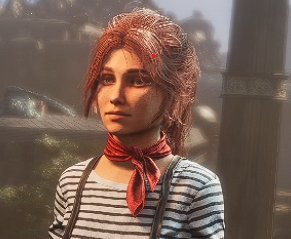
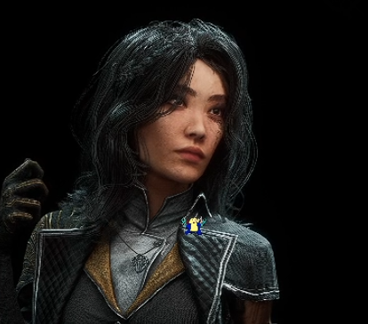
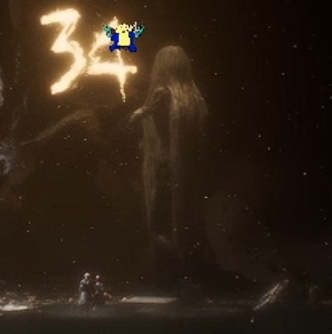
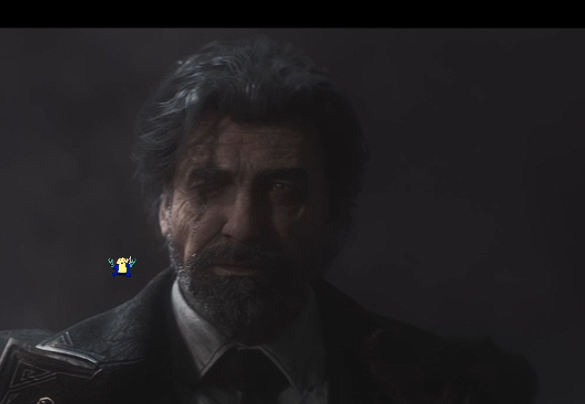
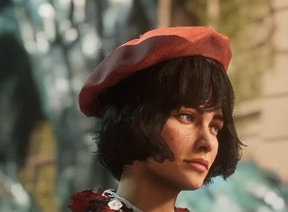
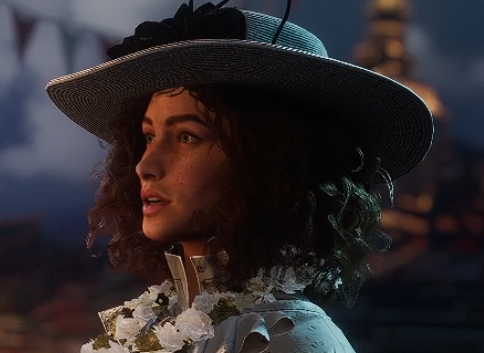
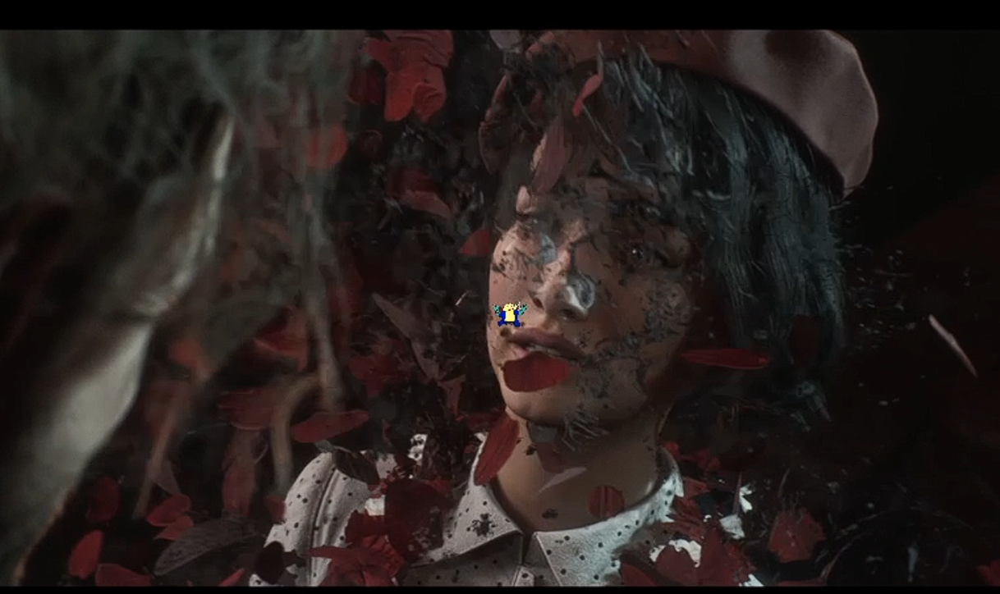
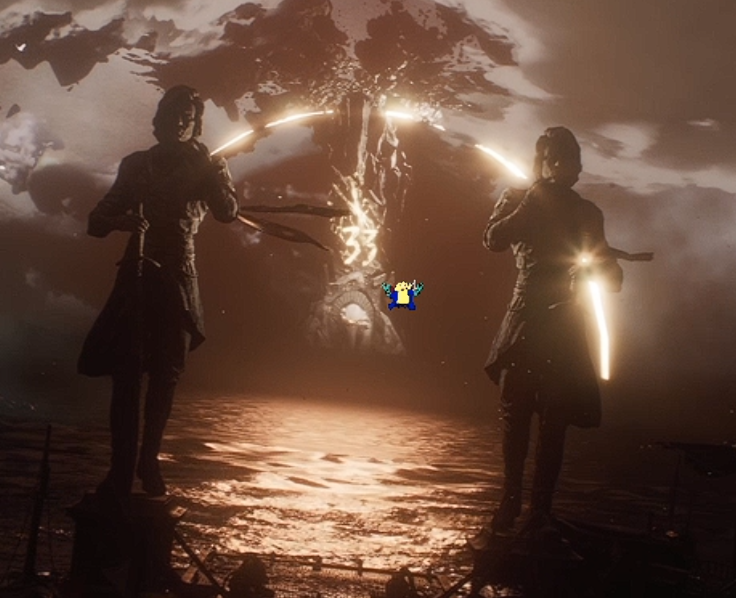

+++
title = "Clair Obscur: Expedition33 メモ"
date = "2026-02-01"

categories = [
"memo"
]

tags = [
"memo"
]
draft = false
+++

## 注意

- **当たり前ですがネタバレを含みます**
- 配信画像からキャプチャとってるので、酔い止め防止トリちゃんがちょいちょい映ります。

## 物語的な

何か変なことになってる世界。
**ペイントレス** っていう女（らしい）によって定期的に一定年齢を超えた人類が消される？
なのでなのかはわからないが、この女を倒すための遠征隊(Expedition)が何かおっかないとこに遠征する。

今回は第33遠征隊っぽい？32遠征隊？
今まで33回行って全部だめだった？
1～33遠征隊が組まれてて別んとこ行ってる？
0遠征隊もあるらしい。BLEACHみたい

みたいな話っぽい。
まだ全然わかってない。

### 2026/01/25

[アーカイブ(ツイッチだから後で消える)](https://www.twitch.tv/videos/2686256615)

今回の遠征ではしょっぱな怪しいおじさんが出てきて隊が壊滅した。
仲間と散り散りになり、仲間を探し求めているところ。
[**ルネ**](#ルネ) が生き残っており、合流し一緒に戦闘している。

### 2026/01/25

[アーカイブ(ツイッチだから後で消える)](https://www.twitch.tv/videos/2692378340)

変な館で[**マエル**](#マエル)と合流した。
館にいるキュレーターとかいうやつがマエルを導いた？
めちゃくちゃ見た目バケモンで怪しいけど主人公一行についてきてるからいい人？
めっちゃ怖いけど。(画像まだ用意できてないすみません)

何か小っちゃくてほうきみたいな頭の奴の館？
そいつらがいる町に手がかりを探しに行くことになったらしい。
人物の欄にまとめるのまだ間に合ってないので今後追加するかも。
あんま関係ない人なら未来永劫追加されない可能性はある。

## 遠征隊

### ギュスターブ

本作の主人公？
イケオジ
何かめっちゃ強い？特別感がある？とかなんとか。
雷を使う。

#### チャージ

何か技使ってると溜まる。
オーバーチャージみたいなので放出できる？

### マエル

結構若い少女。
こう見えてギリ20超えてる？
ギュスターブが1年しか残されてない（32歳？）でマエルは9年あるらしいので23歳前後くらい？
今回の遠征隊の人。

遠征隊壊滅後消息不明だが、メタい話するとパッケージ？にいるので多分生きてる。

### ルネ

何か研究者っぽい人で結構変な人かも？
まだわからない。
今回の遠征隊の生き残り。
魔法系を使うっぽく走る時に浮いてる。うらやましい。

#### ステイン

ナイトレインの隠者のスキルみたいな感じ。
各属性を集めて組み合わせで何か変わるよ的な。

### いったん雑に人名メモ

- カトリーヌ
  - 最初にいい所に酒飲んだ人、明確に死んだ描写が出てきた。ビジュ結構好きだったのに・・・
- ルシアン
  - 最初一緒に酒飲んだ人、化け物に連れてかれた、多分死んだ。いい人やったのに・・・
- トム
- トリスタン
  - 化け物に連れて枯れた、多分死んだ
- マルゴ
  - 多分死んだ
- セバ
- シエル
- バスティアン（32遠征隊の指揮官？）
- アラン（司令官）
  - 謎おっさんに殺害される
- ジェローム
- 他忘れてたらすまん

## 敵

### ペイントレス

こいつを倒しにいく？
画像だとわかりにくいがめちゃくちゃデカい。
この34を33に変えて抹消が起きた（多分）

### 変なおっちゃん

33遠征隊を到着直後に壊滅させた。
どう考えても33以上なのに生きている謎の人物。

### ネヴロン

何か町の人がしきりに言ってた気がする。
まだ何なのか全くわかってない。
変なおっちゃんのことやったりする？

## その他人物

### ソフィー

ギュスターブの元カノ。
何があって別れたかわからないが、後述するが33歳になったので [抹消](#抹消) の対象であり、ギュスターブの目の前で抹消が起こった。
しょっぱなから心をかなりしんどくする演出でちょっと泣きそうになった。やってくれるわね。

### エマ

何か町の偉い人？議長殿らしい。
ギュスターブとは結構見知った仲っぽい。
双子の弟がいるらしい。

エマの後見人らしい。後見人って何？

## システム的なとこ

### ピクトス

何かマテリアみたいなの。パッシブ効果がある。
これを装備して4回勝利するとマスターできるらしい。
マスターするとパッシブが勝手に発動する？
装備はしてないといけない？

#### ルミナ

ピクトスのパッシブ効果のことらしい。

### AP

技とか出すのに必要。
通常攻撃やパリィで溜まる。

### パリィ

そのままパリィ。
思ってる100倍くらい猶予が狭い。
エルデンのパリィとかDMCのロイガとかとおんなじで考えてると全然できない。

### フリーエイム

P5でいうとこの銃。
弱点が露出してたり飛んでる敵にあてるといいらしい。

### やけど

ターン終了時ダメージ。
ポケモンの毒みたいな感じ。
重ね掛けができるらしい。

## 用語など雑多

### 抹消

満33か34歳になると抹消と言って、体が花びらになり散ってしまうような感じになる。
これによって死んでしまうのかどうかはわからないが、わからないので現状は「**死んでしまった**」と認識していこうと思う。
ペイントレスが起きた時に起こるらしく、町の人達はペイントレスを憎んでいる。

自分が死ぬことがわかってるのをゆっくり自覚しながら死ぬの絶対耐えれない。
28歳くらいで心が壊れると思う。

### 何か門？

何か門。
これの33が34になった時にペイントレスが起きて34が消えて33になった。
34以上の人を消す儀式？何のために？
ココの先に遠征する？

### クロマ

金？

### ルミナコンバーター

何か敵倒したあと粒子をそこに溜めてる。
何に使うかまだあんまわかってない。

### 遠征隊の旗

篝火
ここで回復アイテム補充とスキル割り振りなどを行う。

### ルミエール

主人公たちが住んでる町と思う。
崩落だったかなんか忘れたけど、それの場所がよかったとかで運よく生き残ってるってどっかで行ってた気がする。

### 崩壊より前の時代

なんかあるらしい。
