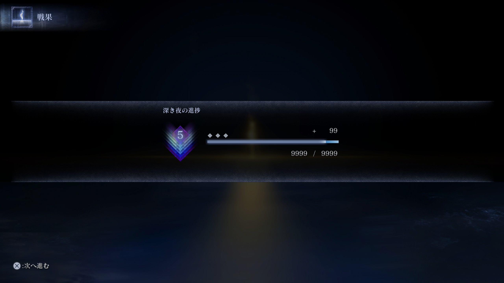
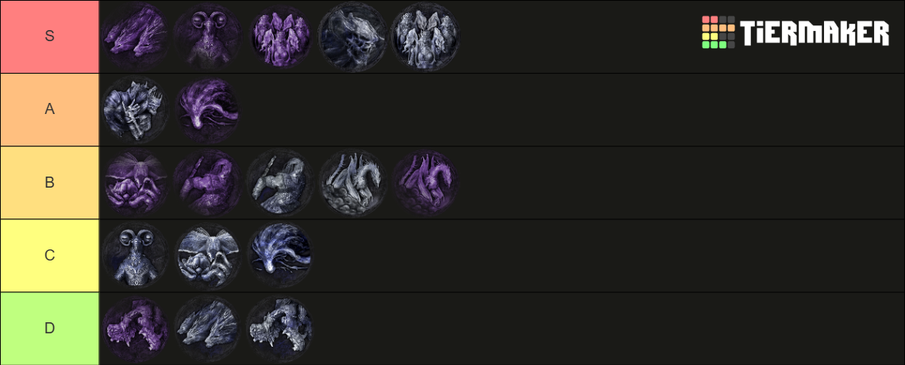

+++
title = "ナイトレイン カンストした感想とカンストを目指すに際して"
date = "2026-02-07"

categories = [
"Memo"
]

tags = [
"Memo", "ナイトレイン"
]
image = "カンストサムネ.png"

draft = true
+++

最近狂ったようにハマった **エルデンリング ナイトレイン** 。
こちらのランクマッチである **深き夜** でランクポイント9999、いわゆる **カンスト** に至ったので、カンストに向けてやったことなどをまとめときたい。

使ったキャラは「**追跡者**」オンリー。ほかのキャラではやらなかった。
結構長くなるので、右側の **目次** から気になるとこだけ読んでくれるだけでうれしい。

## 敵の強さTier

Tier表作ってみた。
**追跡者しか使っていないので近接目線のみです。**
左右差アリで左に行くほど強い。異論は全然アリ。
それぞれ下記のあたりを基準に考えた。

- ボスとしての強さ
- ファーム難易度
- 事故率

### D帯

#### 通常エデレ

| カテゴリ         | ランク |
| ---------------- | ------ |
| ボスとしての強さ | ★☆☆☆☆  |
| ファーム難易度   | ★☆☆☆☆  |
| 事故率           | ★☆☆☆☆  |
| つまんなさ       | ★★★★★  |

弱すぎる。これに負けるんなら色々見なおした方がいいレベル。
流石に味方が落ちまくるんなら考え物やけど、ソロで倒せるくらいになっておくほうがいいかも。

一生行ったり来たりするので、シャトルランを余儀なくされがちでつまんない。
弱いしフラストレーション溜まるし手ごたえ無いしで本当に来てほしくない。
~~数字気にしてた時は来てほしかったけど~~

タゲ取りがちな後衛の近くで来るのを待つが吉。

道中もほんとあんま考えなくていい。
最悪最大カット無くてもなんとかなるので気が楽。
1日目2日目ボスも弱い。
なんならフレイディアが一番強いかもしれない。

#### 常世エデレ

| カテゴリ         | ランク |
| ---------------- | ------ |
| ボスとしての強さ | ★★☆☆☆  |
| ファーム難易度   | ★☆☆☆☆  |
| 事故率           | ★★☆☆☆  |
| つまんなさ       | ★★★★☆  |

右二体と比べると割と比較にならんくらいは強いと思う。
ボスだけでいくならC帯でもいいかもしれないと思った。
でも大技が別に止めても止めなくてもいいみたいな時点であんま強くない。

通常にもあるけど噛みつきに電気の爆発が追加されて、引っかかりがち。
2連噛みつきは高深度だと即死コンなので、そこはたまに事故る。

足元落雷がかなり事故りやすいのでこれは強い。
強化はいる時のデカい電磁波の奴の後、自機に2回足元落雷が来るのを忘れて突っ立ってると死ぬ。
普通に避けた先に落雷があったり、距離とろうとしたら落雷に引っかかったりと。
あれ？やっぱ強いかこいつ？

#### 通常グラディウス

| カテゴリ             | ランク    |
| -------------------- | --------- |
| ボスとしての強さ     | ★☆☆☆☆     |
| ファーム難易度       | ★☆☆☆☆     |
| 事故率               | ★★☆☆☆     |
| 通常だった時の安心感 | ★★★★★ (※) |

**※:** 個人的に常世の方が楽しくて来てほしいので、僕は通常だった時のがっかり感が「★★★★★」

めっちゃ弱い。
分裂時に事故りやすいので、エデレよりは上かなぐらい。
でも常世の開幕と違って時間で帰ってくれるからそこまで気にすることもない。

1，2日目も弱い。ファームもぶっちゃけ気にしなくていい。
鎌レディが居てファーム潤沢であれば、見てらんないくらいの光景が見れる。

### C帯

#### 通常マリス

| カテゴリ         | ランク     |
| ---------------- | ---------- |
| ボスとしての強さ | ★☆☆☆☆      |
| ファーム難易度   | ★★☆☆☆      |
| 事故率           | ★★☆☆☆      |
| つまんなさ       | ★★★★★★★★★★ |

弱い。
なんなら触手が強い。事故の原因の8.5割がおそらく触手。
触手が無かったら本当に弱いのは、みんな常世の前座で体験してると思う。

ファーム難易度というか常世があまりにも別ゲーなので、そっちも考慮しなきゃいけないのでかなりめんどくさい。

つまんなさが天元突破してるのはあんま異論ある人いないと思う。
エデレ以上のシャトルランを強要されるし、別に向こうから寄ってきてくれるわけでもない。何なら遠ざかる。
自分で近づかなきゃいけないのに、すぐに離れるし触手に邪魔されるしクラゲめっちゃだしてくるし。

体が大きい分、移動距離がかなり長いので、敵の目前にたどり着いた瞬間はるか彼方へ移動される。
近づきに行くにしても周りの触手をケアしながら行かないといけない。

かといって本体は強くないので、達成感もない。
ストレス以外の何物でもない。

1、2日目ボスも良くない。
1日目に **ミミズ顔** がいる。カスすぎて遠距離職がいない現場は地獄そのもの。遠距離いてもやだ。ガチストレスボス。
同じHPに調整されたら、マリスより溶鉄デーモンと英雄ガゴの方がつよいと思う。

#### 通常グノスター

| カテゴリ         | ランク |
| ---------------- | ------ |
| ボスとしての強さ | ★★☆☆☆  |
| ファーム難易度   | ★☆☆☆☆  |
| 事故率           | ★★★☆☆  |
| 味方運           | ★★★★★  |

この辺からちゃんとしんどい。
低深度だとパーティの意思統一がされてなくて、グノのタゲ取りがはちゃめちゃになって事故る。
フォルティスが潜った時に、グノスターの方行っちゃってフォルティスも合流しちゃう事故もたまにある。

合体後の `突進＋魔力弾` だけガチでキツイ。
なんなら最近戦犯かましたくらい。
低深度だとこの攻撃が来たら最低1人、最悪2人落ちると思った方がいいくらい。

他は正直ちゃんとやれてたら負ける要素無い。
ケツに張り付いてたら当たらないし。
味方が落ちまくる場合、ガチでキツイ。Aに行くかもしれんくらいキツイ。

ただ、サテライトレーザーとか空から拡散したビーム降ってくる奴とかのせいで、いったん離れないといけない事態がよく起こる。
近づく時も鱗粉に気を付けながらフォルティスの攻撃を気を付けながらと結構ダルイ。この時に結構事故る。

#### 通常リブラ

| カテゴリ             | ランク |
| -------------------- | ------ |
| ボスとしての強さ     | ★★★☆☆  |
| ファーム難易度       | ★★★☆☆  |
| 事故率               | ★★★☆☆  |
| 通常だった時の安心感 | ★★★★★  |

みんな大好きリブラ。

こいつがピックされた時は、ほぼ100%常世が脳裏にチラつく。
常世がちらつきすぎてファームがそっちに引っ張られるのでファーム難易度上げてる。
狙われが出ない時はかなり焦る。
常世に向けてのファーム準備が万端の時は基本こっちが来る。

足元魔方陣が結構事故る。
その後の設置型に気づかず後ろ下がって死ぬ事故も結構ある。
この辺からロックオン外しとかができるようになった方がいい。

強化状態はかなり強いので、Bの左くらいに行くとは思う。
発狂弾タレットが回転する害悪構成。ちゃんと回り込むムーブしてないといつの間にか回ってきた奴に発狂させられる。
阻止できるかも野良の理解度によるのと意思疎通ができるかなので運。

ただ慣れてしまえば結構簡単めだし、楽しい。

### B帯

#### 常世カリゴ

| カテゴリ         | ランク |
| ---------------- | ------ |
| ボスとしての強さ | ★★☆☆☆  |
| ファーム難易度   | ★★★☆☆  |
| 事故率           | ★★★★☆  |
| 阻止知識         | ★★★★☆  |

迷ったけど個人的に通常カリゴの方が苦手なのでこの位置に。
ぶっちゃけもうちょい左でいいかもしれん。

あと大技阻止できる面子がいない場合は全然難易度が変わる。そんなことあんまないけど。
追跡者、無頼漢（2つ）、鉄の目、レディ、執行者、葬儀屋が止めれるしなんなら葬儀屋いると全キャラ止めれることになる。
レディのアーツで止めれるのはあんま知られてなかったりするので、結構連携が必要だったりする。

近接だと基本足元にいるので、強化後の足元氷爆破もあんまり気にならない。なので知らんうちにスリップダメージ床にハマる通常の方が強いっていう持論。

事故率高めに入れてるのはどっちかというと二日目の「**冷たい谷の踊り子**」。
なんならカリゴに負ける時の半分くらいは踊り子に負けてるって人多いのではないかと思ってたりする。

ファームは常世だと炎武器ほしいねって感じ。
まぁなくてもいいっちゃいいけど。

#### 通常カリゴ

| カテゴリ         | ランク |
| ---------------- | ------ |
| ボスとしての強さ | ★★☆☆☆  |
| ファーム難易度   | ★★☆☆☆  |
| 事故率           | ★★★★☆  |
| 床               | ★★★★★  |

床、以上！

一応ろうと雲が出てるところに強化ダメージ氷床ができるが、真っ白のステージに白いろうと雲が出てても気にできるわけなく。
